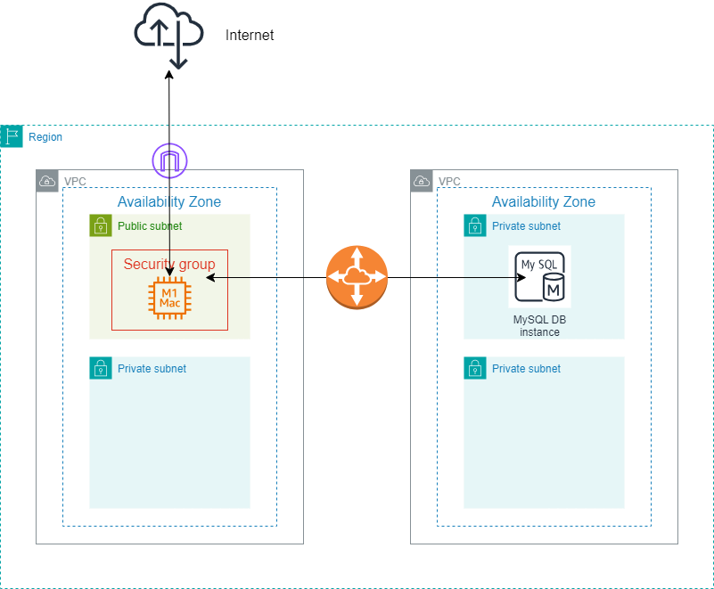

# Create-a-Amazon-VPC-Peering


SUMMARY 

A VPC peering connection is a one-to-one networking connection between two VPCs that enables you to route traffic between them privately. Instances in either VPC can communicate with each other like they are in the same network. You can create a VPC peering connection between your own VPCs, in a VPC in another AWS account, or with a VPC in a different AWS Region. 
 

## ARCHITECTURAL DIAGRAM: 

[](https://github.com/mathebulansuku/Create-a-Amazon-VPC-Peering/blob/main/VPC%20Peering%20Architecture.png)


## Prerequisites

Before we start, you should have created 2 VPCs with 2 subnets on each VPC. The 1st VPC should have a public subnet connected to the internet via an internet gateway. Provision an EC2 instance in the public subnet. 
In one of the subnets in the 2 second VPC, provision a DB instance that will be used to communicate with the EC2 instance in VPC 1. 

 

In the AWS Management Console, on the Services menu, choose VPC. 

- Create 2 VPC and name them Requester and Acceptor VPC. 

- In the left navigation panel, choose Peering Connections. 

Choose Create Peering Connection and configure:
```
- Peering connection name tag: Lab-Peer 
- VPC (Requester): VPC 1 
- VPC (Accepter): VPC 2
```

Choose Create Peering Connection then choose OK 

When a VPC peering connection is created, the target VPC must accept the connection request. The target VPC must accept the request because it might be owned by a different account. Alternatively, the user that creates the peering connection might not have permission to accept the connection request for the target VPC. 
Now you will configure the Route Tables to establish a connection between the VPCs. 

In the left navigation panel, choose Route Tables. 

Select Public Route Table (VPC 1). 

You will configure the Public Route Table associated with Lab VPC. If the destination IP address falls in the range of VPC 2, the Public Route Table will send traffic to the peering connection. 

In the Routes tab, choose Edit routes then configure these settings: 

Choose Add route 

Destination: ex, 10.5.0.0/16 (The setting is the Classless Inter-Domain Route, or CIDR, block range of Shared VPC.) 

Target: Select Peering Connection, and then from the list, select Lab-Peer. 

Choose Save routes then choose Close. 

You will now configure the reverse flow for traffic that comes from VPC 2 and goes to VPC 1. 

Select Shared-VPC Route Table. If the check boxes for any other route tables are selected, clear them. 

This route table is for Shared VPC. You will now configure it to send traffic to the peering connection if the destination IP address falls in the range of Lab VPC. 

In the Routes tab, choose Edit routes then configure these settings: 

Choose Add route 

Destination: 10.0.0.0/16 (This setting is the CIDR block range of Lab VPC.) 

Target: Select Peering Connection, and then from the list, select Lab-Peer. 

Choose Save routes then choose Close. 

The route tables are now configured to send traffic via the peering connection when the traffic is destined for the other VPC. 
